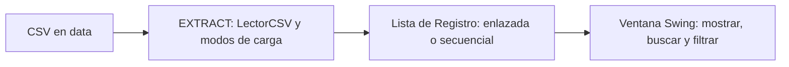
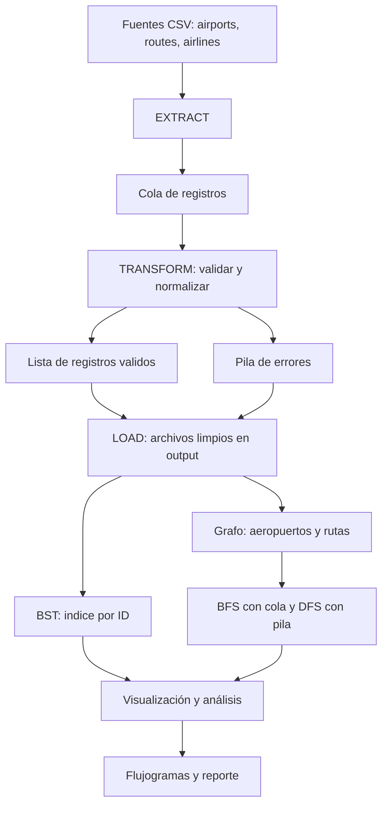

# SmartETL-DS

Proyecto final integrador de **Estructuras de Datos** (Ingeniería de Software, tercer semestre, Universidad Técnica de Ambato, FISEI). Docente: José Caiza. Lenguaje: Java. Modalidad: grupal con defensa individual.

Estado actual: **Hito 1 (1 de octubre de 2026)**, equivalente al 20 a 25 % del proyecto.

## 1. Problema y dominio

Las aerolíneas, los aeropuertos y las rutas del mundo se publican en archivos planos con datos incompletos, nulos, duplicados y referencias rotas. El sistema **extrae** esos datos, los **transforma y valida**, los **carga** en archivos limpios y los organiza con **estructuras de datos propias** (listas, pilas, colas, árbol BST y grafo) para consultarlos. Al final, un módulo genera flujogramas y reportes de los algoritmos.

Dominio elegido: **Transporte aéreo** (aeropuertos, rutas y aerolíneas). Es uno de los dominios alternativos que propone el documento del proyecto ("Transporte: vehículos o rutas por código, ciudades y conexiones") y el mismo conjunto de datos se usará durante todo el semestre.

## 2. Dataset

Base de datos abierta **OpenFlights** (https://openflights.org/data.html). Los archivos originales se llaman `airports.dat`, `routes.dat` y `airlines.dat`, y tienen formato **CSV** (valores separados por comas, sin encabezados, nulos marcados como `\N`). Se renombraron a `.csv` sin modificar su contenido. Más detalles en `data/FUENTE.txt`.

| Archivo | Filas | Campos | Uso futuro |
|---|---|---|---|
| `data/airports.csv` | 7.698 | 14 | Vértices del grafo, clave del BST (ID) |
| `data/routes.csv` | 67.663 | 9 | Aristas del grafo (origen, destino) |
| `data/airlines.csv` | 6.162 | 8 | Catálogo de aerolíneas |

Los datos son **sucios a propósito**, porque el Transform del hito 2 tiene que limpiarlos. Esto es lo que hay en los archivos de este repositorio:

| Problema | Cantidad | Tratamiento previsto en Transform |
|---|---|---|
| Aeropuertos sin código IATA (`\N`) | 1.626 | Campo opcional: pasa a "Sin dato", el registro sigue siendo válido |
| Aeropuertos sin ciudad (vacío) | 49 | Decidir regla: obligatorio u opcional |
| Rutas con ID de origen `\N` | 220 | Recuperar el ID con el código del aeropuerto, o mandar a la pila de errores |
| Rutas con ID de destino `\N` | 221 | Igual |
| Rutas con ID de origen inexistente en `airports` | 263 | Referencia rota: pila de errores |
| Rutas con ID de destino inexistente en `airports` | 267 | Referencia rota: pila de errores |
| Rutas con campo final (equipo) vacío | 18 | Dato opcional |
| Rutas sin codeshare (vacío) | 53.066 | No es error, significa "no es codeshare" |

Los datos son públicos y no contienen información personal.

## 3. Alcance del Hito 1

Flujo entregado:



| Requisito del hito | Dónde está |
|---|---|
| Problema y dominio definidos | Sección 1 de este README |
| Dataset inicial en CSV | `data/` |
| Modelo de clases Java | `src/model/` |
| Lectura de archivos (Extract) | `src/etl/` |
| Lista de registros implementada y funcional | `src/estructuras/` |
| Mostrar y consultar datos | `src/app/` (ventana Swing) |
| Repositorio GitHub con commits iniciales | Sección 9 |
| Arquitectura del proyecto completo | Sección 4 |
| Distribución de responsabilidades | Sección 8 |

Lo que **no** se hace todavía: cola, Transform, pila de errores, Load, búsqueda binaria y ordenamiento, BST, grafo, BFS y DFS. El Extract deja los datos **crudos**, tal como vienen, para que el Transform tenga trabajo real en el hito 2.

## 4. Arquitectura del proyecto completo



Reutilización entre módulos: la cola sirve al ETL y a BFS, la pila a los errores y a DFS, y la lista enlazada a la lista de válidos y a las adyacencias del grafo.

## 5. Estructura del repositorio

```
SmartETL_DS/
|-- src/
|   |-- model/          Aeropuerto, Aerolinea, Ruta, Registro
|   |-- estructuras/    Nodo, Lista, ListaEnlazada, ListaSecuencial, Criterio, ResultadoBusqueda
|   |-- etl/            Extract, LectorCSV, OpcionesCarga, ModoCarga, FuenteDatos, Mapeador, ResultadoExtraccion
|   |-- app/            Main, VentanaPrincipal, ModeloTablaRegistros
|   |-- pruebas/        PruebasHito1
|   `-- algoritmos/     (hitos 3 a 6)
|-- data/               airports.csv, routes.csv, airlines.csv, FUENTE.txt
|-- output/             (archivos limpios y reportes, desde el hito 3)
|-- diagramas/          (flujogramas, hito 5)
|-- docs/               GUION-DEMO.md
`-- README.md
```

## 6. Decisiones de diseño del Hito 1

| Decisión | Por qué |
|---|---|
| Interfaz `Lista<T>` con dos implementaciones | El documento pide lista secuencial y lista enlazada. Con una interfaz común, el Extract y la ventana funcionan con cualquiera y se pueden comparar |
| `ListaEnlazada` con `head` y `tail` | `insertarFinal` es O(1), así los registros quedan en el orden de llegada sin recorrer la lista |
| `ListaSecuencial` que duplica su capacidad | No se sabe cuántas filas tendrá un archivo, así que no hay un `MAX` fijo |
| Sin `ArrayList`, `LinkedList`, `Stack` ni `Queue` de Java en el núcleo | Regla del docente: las estructuras deben ser propias |
| `buscar` devuelve posición y número de comparaciones | Permite demostrar que la búsqueda en lista es O(n) y compararla después con el BST |
| `LectorCSV` propio en lugar de `split(",")` | `split` descarta los campos vacíos del final (18 filas de `routes`) y parte los textos con coma entre comillas |
| Los campos se guardan como texto crudo | Extract solo lee. Convertir tipos, unificar `\N` y validar rangos es responsabilidad de Transform |
| Modos de carga Todos, Primeros N, Rango y Aleatorio con semilla | Sirven para probar y para defender con muestras pequeñas. Con la misma semilla la muestra se repite |
| Líneas con número de campos inesperado se cuentan como "no leídas" | No se pierden en silencio. En estos archivos son 0 |

Aviso para el grafo (hitos 5 y 6): una muestra aleatoria de aeropuertos y otra de rutas casi nunca se conectan entre sí. Para el grafo hay que usar los datos completos o filtrar las rutas a las de los aeropuertos elegidos.

## 7. Cómo ejecutar

Requisito: **JDK 11 o superior**.

**IntelliJ IDEA**
1. `File > Open` y elegir la carpeta `SmartETL_DS`.
2. Si aparece "Project SDK is not defined", ir a `File > Project Structure > Project` y elegir un JDK 11 o superior.
3. Clic derecho sobre `src/app/Main.java` y `Run 'Main.main()'`.

La carpeta de trabajo debe ser la raíz del proyecto (es lo que IntelliJ usa por defecto), porque la ventana busca los datos en `data/`.

**Terminal**

```
Linux o macOS:  javac -encoding UTF-8 -d out $(find src -name "*.java") && java -cp out app.Main
Windows:        mkdir out
                dir /s /b src\*.java > fuentes.txt
                javac -encoding UTF-8 -d out @fuentes.txt
                java -cp out app.Main
```

**Uso de la ventana**
1. Elegir los datos (aeropuertos, aerolíneas o rutas), la estructura donde guardar y el modo de carga. Pulsar **Cargar**.
2. Las celdas con `\N` salen en rojo y los campos vacíos en amarillo.
3. En **Consulta** elegir un campo y un valor. **Buscar** encuentra la primera coincidencia y muestra en qué posición estaba y cuántas comparaciones costó. **Filtrar** muestra todas las que contienen el texto. **Ver todos** restaura la lista.

## 8. Equipo y responsabilidades

| Integrante | Usuario GitHub | Responsabilidad en el Hito 1 | Archivos |
|---|---|---|---|
| Chico Yunda Juan Carlos (líder) | juanchicoyunda1234 | Arquitectura, contratos (interfaces), ventana Swing e integración | `src/app/`, `Lista`, `Criterio`, `ResultadoBusqueda`, `Registro`, `Mapeador` |
| Tuza Quinatoa Noemi | edithtuza15-collab | Extract y lectura de archivos | `src/etl/` (menos `FuenteDatos`) |
| Romo Nunez Joseph | wayusa25-cmyk | Lista enlazada | `Nodo`, `ListaEnlazada` |
| Llamuca Abrajan Andres | llamucaandres161 | Lista secuencial | `ListaSecuencial` |
| Torosina Armendariz Jeremy | WinoSpop | Modelo de clases y datasets | `src/model/` (menos `Registro`), `data/`, `FuenteDatos` |
| Altamirano Segovia Jullisa | jullisaaltamirano2017-boop | README, diagramas y documentación | `README.md`, `docs/`, `diagramas/` |

Todos: pruebas (`src/pruebas/`), integración y defensa. Cada integrante debe poder explicar el sistema completo, no solo su módulo.

## 9. Flujo de trabajo con Git

Una rama por funcionalidad y Pull Request para integrar. El historial es parte de la evidencia de colaboración.

**Commit inicial (líder), en `main`:** `.gitignore`, `SmartETL_DS.iml`, `.idea/modules.xml`, `.idea/encodings.xml`, `README.md`, `data/`, y los contratos `Lista.java`, `Criterio.java`, `ResultadoBusqueda.java`, `Registro.java` y `Mapeador.java`.

```
git init
git branch -M main
git add .gitignore SmartETL_DS.iml .idea README.md data
git add src/estructuras/Lista.java src/estructuras/Criterio.java src/estructuras/ResultadoBusqueda.java
git add src/model/Registro.java src/etl/Mapeador.java
git commit -m "Estructura inicial, dataset OpenFlights y contratos"
git remote add origin <URL_DEL_REPOSITORIO>
git push -u origin main
```

**Cada integrante, desde su propia cuenta:**

```
git clone <URL_DEL_REPOSITORIO>
git checkout -b feature/lista-enlazada
git add src/estructuras/Nodo.java src/estructuras/ListaEnlazada.java
git commit -m "Agrega Nodo y ListaEnlazada con head y tail"
git push -u origin feature/lista-enlazada
```

Ramas sugeridas: `feature/lista-enlazada`, `feature/lista-secuencial`, `feature/extract`, `feature/modelo-y-datos`, `feature/ventana-swing`, `feature/documentacion`. Luego se abre un Pull Request hacia `main` y otro integrante lo revisa.

## 10. Pruebas

`src/pruebas/PruebasHito1.java` es un programa que no necesita librerías. Ejecuta 53 verificaciones sobre el lector CSV, las validaciones de carga, las dos listas y el Extract con los tres archivos reales (conteos exactos, campos vacíos, modos de carga, semilla y orden). Ejecutar `pruebas.PruebasHito1` desde la raíz del proyecto. Debe terminar con `fallaron: 0`.

Para la defensa del hito frente al docente, consultar el guion paso a paso en `docs/GUION-DEMO.md`, que detalla el flujo de 5 minutos y las respuestas a las preguntas teóricas clave.

## 11. Planificación

| Fecha | Hito | Evidencia esperada |
|---|---|---|
| 1 oct. | Hito 1, primer parcial | Prototipo funcional, dataset, lista, GitHub y arquitectura |
| 16 oct. | Hito 2, ETL | Extract, Transform, Cola, Lista y Pila |
| 30 oct. | Hito 3, Procesamiento | Load, búsqueda, ordenamiento y archivos limpios |
| 13 nov. | Hito 4A, Árbol | BST y recorridos funcionales |
| 25 nov. | Hito 4B, Grafo | Grafo, BFS, DFS, rutas y ciclos |
| 30 nov. | Hito 5, Flujogramas | Flujogramas automáticos y documentación técnica |
| 1 al 3 dic. | Cierre técnico | Integración, pruebas, README e informe |
| 4 dic. | Defensa final | Sistema completo, defensa grupal e individual |
