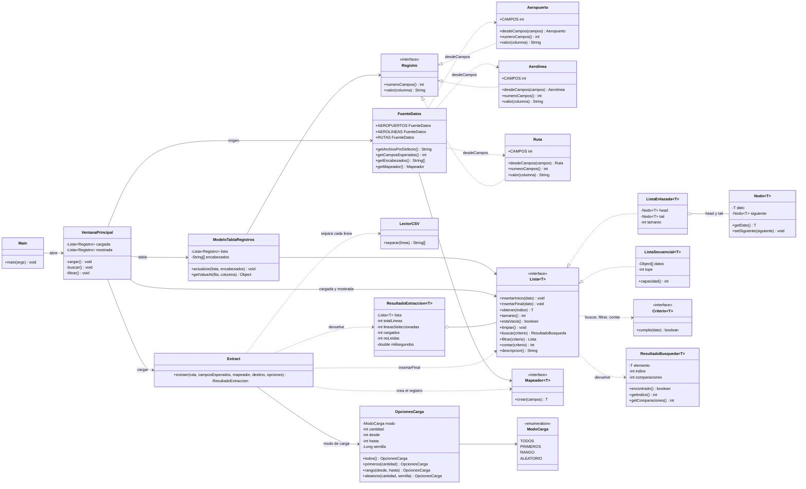
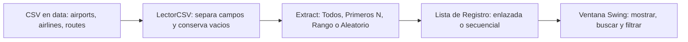
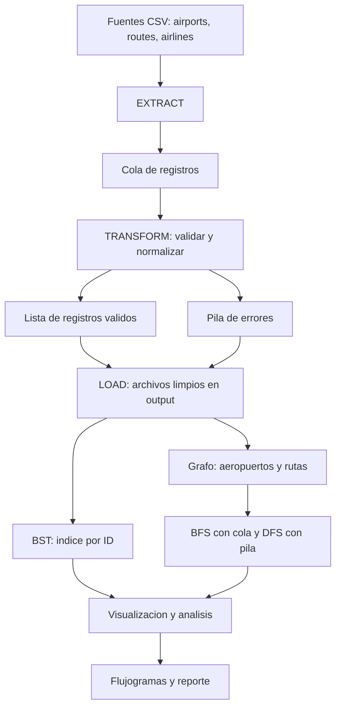

# Diagramas del Hito 1

Diagramas del código que está en `src/`. Cola, pila, Transform, Load, BST y grafo se nombran solo en la arquitectura prevista: todavía no hay clases de esos módulos.

## Diagrama de clases

`Aeropuerto` tiene 14 campos, `Aerolinea` 8 y `Ruta` 9. Los tres guardan el texto tal como viene del CSV. `ListaEnlazada` inserta al final en O(1) porque conserva `tail`. `ListaSecuencial` duplica el arreglo al llenarse; la capacidad inicial es 16.

## Flujo entregado en el Hito 1

## Arquitectura prevista del proyecto completo

Estos módulos no están implementados. El diagrama solo fija cómo se van a conectar en los hitos siguientes.

